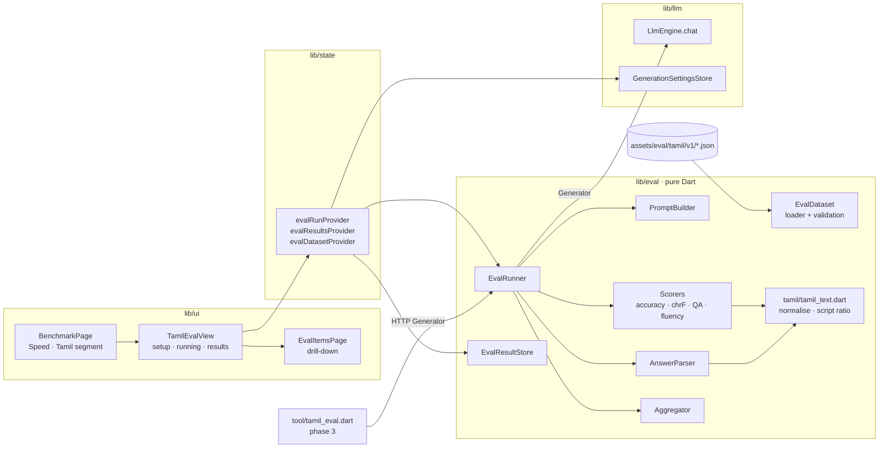
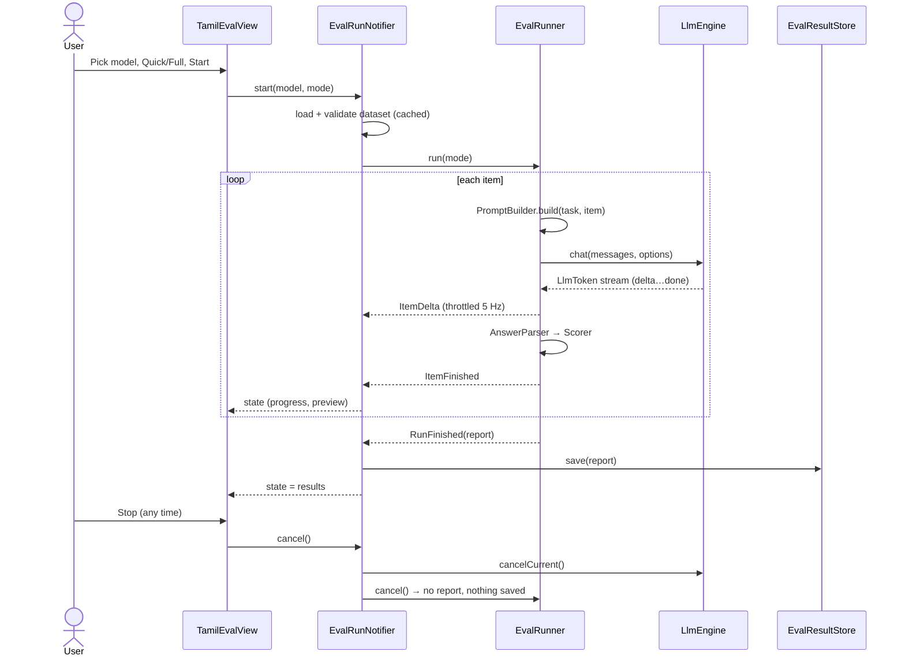
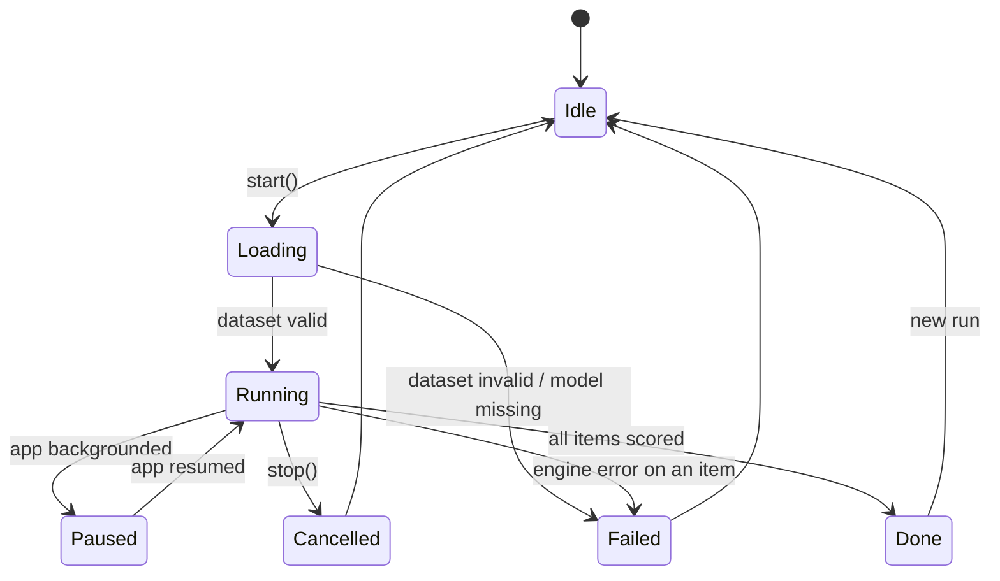

# LLD: Tamil LLM Evaluation & Benchmarking

| | |
|---|---|
| **Issue** | [#3](https://github.com/Abhinivesh2729/Thinai/issues/3) |
| **Product doc** | [PRD.md](PRD.md) |
| **Status** | Draft, for maintainer review |

This document says how the PRD gets built: modules, data formats, algorithms, flows, and how it is tested. Section numbers are referenced from the PRD.

---

## 1. Design principles

1. **Everything except the engine is pure Dart.** The dataset, text normalisation, prompt building, answer parsing, scoring and aggregation have no Flutter or FFI imports. So they can be tested with `flutter test` in CI (the 100% gate). The phase 3 CLI reuses them unchanged.
2. **The generator is injected.** The runner never touches `LlmEngine.instance`. It takes a `Generator` function. The app passes one backed by `LlmEngine`, tests pass a fake, and the CLI passes an HTTP client.
3. **Tasks are data.** A task is a JSON manifest entry (template, scorer id, token budget, weight) plus a JSON items file. Adding an item never needs a code change. Adding a new *kind* of scorer does.
4. **Same code paths as the speed benchmark.** Generation options come from `GenerationSettingsStore.optionsFor`, so eval runs use the user's saved GPU and context settings, including the GPU crash guard in `LlmEngine._run`.
5. **Language-agnostic core.** Only `lib/eval/tamil/` knows about Tamil. Another language would be one more folder and one more asset directory.

## 2. Architecture



## 3. Module layout

```
lib/eval/
  eval_models.dart        // EvalManifest, EvalTaskSpec, EvalItem, ItemResult, TaskScore, EvalReport
  eval_dataset.dart       // load + validate a dataset from JSON strings
  prompt_builder.dart     // task template + item -> List<ChatMessage>
  answer_parser.dart      // raw output -> parsed answer (MCQ letter, trimmed text); strips <think>
  scorers/
    scorer.dart           // abstract Scorer + registry keyed by manifest `scorer` id
    accuracy.dart         // MCQ exact letter match
    chrf.dart             // chrF (n=6, β=2), sacreBLEU-compatible
    qa.dart               // max(exact match, token F1) over accepted answers
    fluency.dart          // heuristic T2 score
  aggregator.dart         // item -> task -> overall; chance-line flags
  eval_runner.dart        // drives items through a Generator, emits progress
  eval_result_store.dart  // JSON files + summary index
  tamil/
    tamil_text.dart       // Tamil NFC subset, cleanup, script ratio, tokenising
assets/eval/tamil/v1/
  manifest.json
  comprehension.json  generation.json  grammar.json
  translation.json    qa.json          context.json     knowledge.json
lib/ui/pages/benchmark/
  tamil_eval_view.dart    // segment body: setup / running / results
  eval_items_page.dart    // per-task drill-down
  eval_compare_page.dart  // models x tasks table
tool/tamil_eval.dart      // phase 3 CLI
test/eval/...             // one test file per lib/eval file, plus a dataset validation test
```

`pubspec.yaml` changes: register `assets/eval/tamil/v1/` under `flutter.assets`. **No new dependencies.** (Tamil normalisation is written by hand, §5.1, so we don't need a full Unicode NFC package.)

## 4. Data formats

### 4.1 `manifest.json`

```json
{
  "language": "ta",
  "version": "1.0.0",
  "chanceThreshold": 35,
  "tasks": [
    { "id": "comprehension", "label": "Comprehension", "labelTa": "புரிதல்",
      "file": "comprehension.json", "scorer": "accuracy", "format": "mcq",
      "maxTokens": 16, "weight": 1, "quick": ["t1-001","t1-004","t1-009","t1-013","t1-018"] },
    { "id": "generation", "label": "Fluency", "labelTa": "சரளம்",
      "file": "generation.json", "scorer": "fluency", "format": "open",
      "maxTokens": 200, "weight": 1, "heuristic": true, "quick": ["…"] },
    { "id": "translation", "label": "Translation", "labelTa": "மொழிபெயர்ப்பு",
      "file": "translation.json", "scorer": "chrf", "format": "translate",
      "maxTokens": 160, "weight": 1, "subgroups": ["ta-en", "en-ta"], "quick": ["…"] }
  ]
}
```

### 4.2 Item shapes (one per `format`)

```jsonc
// mcq: comprehension, grammar, context, knowledge
{ "id": "t3-007", "passage": "optional context …", "question": "…",
  "options": ["…","…","…","…"], "answer": "C", "tags": ["case-suffix"] }

// open: generation
{ "id": "t2-004", "instruction": "உங்கள் ஊரின் மழைக்காலத்தைப் பற்றி மூன்று வாக்கியங்கள் எழுதுங்கள்.",
  "minChars": 60, "maxChars": 600 }

// translate
{ "id": "t4-012", "direction": "en-ta", "source": "…", "references": ["…"] }

// qa
{ "id": "t5-011", "passage": "optional", "question": "…", "answers": ["…","…"] }
```

### 4.3 Validation (done when the dataset loads and again in `test/eval/dataset_test.dart`)

- IDs are unique across the dataset, and every `quick` ID exists.
- MCQ items have exactly 4 options and `answer ∈ {A,B,C,D}`. Across each task, correct answers are spread over the four letters (so a model that always answers "A" can't score well).
- Tamil fields have a script ratio ≥ 0.9 (§5.3). English fields (`source` for `en-ta`, `references` for `ta-en`) have a script ratio of 0.
- Each task has exactly the number of items the manifest declares (v1: 20; translation 10 + 10).

If validation fails the dataset won't load, so a bad asset can't produce a misleading score.

## 5. Tamil text handling (`lib/eval/tamil/tamil_text.dart`)

### 5.1 Normalisation

Tamil has several two-part vowel signs that Unicode lets you write either as one code point or as a pair. Models produce both, so without normalisation the same-looking `கொ` can be two different code-point sequences, and an exact match fails. We write only the Tamil compositions NFC would make, which saves adding an NFC dependency:

| Decomposed | Composed |
|---|---|
| U+0BC6 U+0BBE (ெ + ா) | U+0BCA ொ |
| U+0BC7 U+0BBE (ே + ா) | U+0BCB ோ |
| U+0BC6 U+0BD7 (ெ + ௗ) | U+0BCC ௌ |
| U+0B92 U+0BD7 (ஒ + ௗ) | U+0B94 ஔ |

`normalize(s)`:
1. Apply the compositions above.
2. Remove ZWJ/ZWNJ (U+200D / U+200C) and BOM.
3. Map full-width and curly punctuation to ASCII. Collapse runs of whitespace. Trim.

`normalizeForMatch(s)` also: lowercases ASCII, strips punctuation (ASCII, `।`, `॥`), and removes a final `.`/`?`. Used by QA matching and MCQ fallback matching.

### 5.2 Tokenising for QA F1

Split `normalizeForMatch(s)` on whitespace. We deliberately **don't strip suffixes**. Without a proper morphological analyser, stripping suffixes would do more harm than good, and chrF already gives partial credit for suffixes in translation.

### 5.3 Script ratio

`tamilRatio(s) = |letters in U+0B80–U+0BFF| / |letters|`. Digits, punctuation and whitespace are ignored. Returns 0 for a string with no letters.

## 6. Pipeline for one item

### 6.1 Prompt building

Each item becomes `[system, user]` messages. **Instructions are in English and the content is in Tamil.** That measures Tamil ability, not whether the model can follow instructions written in Tamil, and keeps the templates the same if another language is added later. (Open question L1.)

| Format | System | User |
|---|---|---|
| mcq | `You are taking a Tamil language test. Answer with only the letter of the correct option (A, B, C or D). Do not explain.` | `{passage?}\n\nகேள்வி: {question}\nA. {o1}\nB. {o2}\nC. {o3}\nD. {o4}\n\nAnswer:` |
| open | `You are a fluent Tamil writer. Reply only in Tamil script.` | `{instruction}` |
| translate ta-en | `Translate the Tamil text to English. Output only the translation.` | `{source}` |
| translate en-ta | `Translate the English text to Tamil. Output only the translation, in Tamil script.` | `{source}` |
| qa | `Answer the question in Tamil with a short phrase only. Do not explain.` | `{passage?}\n\nகேள்வி: {question}` |

**Thinking models** (`ModelTraits.thinking == true`): `/no_think` is added to the system message. This is the Qwen3 soft switch, and other templates ignore it. `<think>…</think>` is removed from the output before parsing either way. Thinking is turned off because it would multiply the runtime and measure reasoning, not Tamil. (Open question L2.)

### 6.2 Generation options

```dart
final base = await GenerationSettingsStore.instance.optionsFor(
  model,
  requestedTemperature: 0.0,        // greedy -> deterministic (PRD G1)
  requestedContext: 4096,           // every item fits; saves memory on 4 GB phones
  maxTokens: task.maxTokens,
);
```

The native layer caches `server_context`s per model (`fllama_inference_queue.h`, `ServerManager`). So consecutive items reuse the loaded weights, and only the first item pays the load time.

### 6.3 Answer parsing (`answer_parser.dart`)

```
parseMcq(raw, options):
  t = normalize(stripThink(raw))
  1. /^\s*[\(\[]?([A-D])[\)\].:]?(\s|$)/        -> letter        (first char position)
  2. /(answer|விடை)\s*[:：]?\s*\(?([A-D])\b/i   -> letter
  3. exactly one option whose normalizeForMatch() is a substring of normalizeForMatch(t) -> that option's letter
  4. otherwise -> Unparsed
parseText(raw):
  normalize(stripThink(raw)), cut at the first blank line (drops trailing explanations)
```

A result is `ParsedAnswer { String? value; bool parsed; }`. An unparsed MCQ answer scores 0 and is shown as *unparsed* in the drill-down.

### 6.4 Scorers

All return `double` in `[0, 1]` per item. The aggregator multiplies by 100.

| id | Algorithm |
|---|---|
| `accuracy` | `parsed && letter == item.answer ? 1 : 0` |
| `qa` | `max over answers a of max(EM(pred, a), F1(pred, a))`, where EM compares `normalizeForMatch` strings and F1 is SQuAD token F1 over §5.2 tokens |
| `chrf` | chrF with char n-gram order 6, β = 2, whitespace removed, computed on `normalize()`d text, averaged over n = 1..6 with sacreBLEU's smoothing for missing orders. Scored per sentence and averaged per task (this differs from corpus-level chrF, see below). With several references, the best one is used. Checked against sacreBLEU outputs as golden test values. |
| `fluency` | see §6.5 |

Per-sentence chrF, averaged, is used instead of corpus chrF so every item has its own score in the drill-down. The difference from corpus chrF on 10 short sentences is small, and the docs say which one we use.

### 6.5 Fluency heuristic (T2)

```
script   = tamilRatio(out)                               // 0..1, wants ≈1
length   = 1 if minChars ≤ |out| ≤ maxChars
           else linear falloff to 0 at 0 and at 2×maxChars
distinct = |unique word 3-grams| / |word 3-grams|        // 1 if < 3 words; catches loops
fluency  = 0.5·script + 0.2·length + 0.3·distinct
```

This measures **"writes real, non-repeating Tamil of the right length."** It doesn't measure grammar or style: T3 covers grammar, and style is out of scope (PRD §3). The UI labels T2 *heuristic*. The weights live in code as named constants with tests. In phase 3 the CLI could offer an optional model-judge scorer behind a flag.

### 6.6 Aggregation

```
taskScore(t)   = 100 · mean(itemScore)                         // translation: mean of its subgroups' means
overall        = Σ weight_t · taskScore(t) / Σ weight_t
nearChance(t)  = t.scorer == accuracy && taskScore(t) ≤ manifest.chanceThreshold
indicative     = mode == quick
```

## 7. Runner

### 7.1 API

```dart
typedef Generator = Stream<LlmToken> Function(
    List<ChatMessage> messages, GenerationOptions options);

class EvalRunner {
  EvalRunner({required EvalDataset dataset, required Generator generate,
              required GenerationOptions Function(EvalTaskSpec) optionsFor,
              bool thinkingModel = false});

  /// Emits progress after every item. Completes with the report. Cancel by
  /// cancelling the subscription or calling [cancel].
  Stream<EvalProgress> run({required EvalMode mode});
  void cancel();
}

sealed class EvalProgress {}
class ItemStarted  extends EvalProgress { taskId, itemId, index, total }
class ItemDelta    extends EvalProgress { String partial }        // live preview
class ItemFinished extends EvalProgress { ItemResult result }
class RunFinished  extends EvalProgress { EvalReport report }
```

Items run **one at a time** in manifest order: tasks in manifest order, items in file order. Running them one at a time makes the results deterministic, and `LlmEngine` runs requests in sequence anyway.

### 7.2 Sequence: one full run in the app



### 7.3 Run state machine (`EvalRunNotifier`)



- **Pause and resume:** `AppLifecycleListener`. On `paused` the notifier waits for the current item to finish, then stops sending new ones. It sends them again on `resumed`. We don't rely on the foreground service for this, since that service exists for the API server.
- **Engine error on one item:** we retry that item once. If it fails again, the run goes to `Failed` and shows the error, with the partial results visible but **not saved**. A score built from only some items would be misleading.
- **Screen stays awake while `Running`.** We'd use the platform flag through the existing Android activity, or add `wakelock_plus` if the maintainer is OK with a dependency (open question L3).

## 8. Persistence (`eval_result_store.dart`)

| What | Where | Why |
|---|---|---|
| Full report (every item: prompt ID, raw output, parsed answer, score) | `getApplicationSupportDirectory()/eval/ta/<datasetVersion>/<modelId>.json` | ~50–150 KB per model, too big for SharedPreferences |
| Summary index `{modelId → {version, mode, overall, perTask, at, modelBytes}}` | SharedPreferences key `eval_summary_ta_v1` | Fast reads for the Models page chip and the compare table without opening files |

Same rule as `BenchmarkStore`: **only the latest run is kept per (model, dataset version)**, and a Full run replaces a Quick run but a Quick run never replaces a Full one. Decoding skips malformed entries instead of throwing, as `benchmark_store.decode` does.

```dart
class EvalReport {
  final String language;        // "ta"
  final String datasetVersion;  // "1.0.0"
  final EvalMode mode;          // quick | full
  final String modelId;
  final int modelBytes;         // a re-quantised file is a different measurement
  final DateTime at;
  final Duration elapsed;
  final double overall;
  final Map<String, TaskScore> tasks;
  final List<ItemResult> items;
}
```

## 9. State (`lib/state/providers.dart` additions)

```dart
final evalDatasetProvider = FutureProvider.family<EvalDataset, String>(...);   // by language
final evalResultStoreProvider = Provider<EvalResultStore>(...);
final evalSummariesProvider =
    StateNotifierProvider<EvalSummariesController, Map<String, EvalSummary>>(...);
final evalRunProvider =
    StateNotifierProvider.autoDispose<EvalRunNotifier, EvalRunState>(...);
```

`EvalRunNotifier` builds the app's `Generator` like this:

```dart
Generator g = (msgs, opts) =>
    ref.read(llmEngineProvider).chat(msgs, modelPath: model.path, options: opts);
```

## 10. UI components

| Component | Notes |
|---|---|
| `BenchmarkPage` | Gets a `SegmentedButton<_Mode>{speed, tamil}` under the AppBar. The speed body moves into `_SpeedView` without changes. The selected segment is kept in a `StateProvider`. |
| `TamilEvalView` | Switches on `EvalRunState` and reuses `_ModelPicker`, `_ErrorCard` and `_EmptyBenchmark` (made library-visible). |
| `_EvalScoreHeader` | Big overall score, dataset version, mode badge, elapsed time |
| `_TaskBars` | `CustomPainter` bars (like `_ThroughputGraph`), a 25% chance tick on MCQ tasks, and chips for *heuristic*, *near chance* and *indicative* |
| `EvalItemsPage` | `ListView` of `ItemResult`s. The expandable row shows the prompt, expected answer, raw output and parsed answer. Model output is shown as plain text, **not** markdown. |
| `EvalComparePage` | `DataTable`: one row per model, columns overall + T1…T7, sortable |
| Models page chip | `த 72` on a model card when there is a summary. Tapping it opens the results. |

Tamil labels come from `labelTa` in the manifest. The app isn't localised yet, so both labels are shown (`Grammar · இலக்கணம்`).

## 11. Testing (keeps the 100% coverage gate green)

| Test file | Covers |
|---|---|
| `test/eval/tamil_text_test.dart` | Each of the 4 compositions, ZWJ/ZWNJ removal, punctuation, `tamilRatio` edge cases (empty, mixed, digits) |
| `test/eval/answer_parser_test.dart` | Every parse rule (1–3) and unparsed outputs, `<think>` removal, Tamil text around the letter |
| `test/eval/chrf_test.dart` | Golden values from sacreBLEU for ~10 en and ta sentence pairs; identical text scores 1.0; empty output scores 0.0; best of several references |
| `test/eval/qa_test.dart` | EM, F1, several accepted answers, normalisation |
| `test/eval/fluency_test.dart` | Each component on its own plus the weighted total; repetition detection; length falloff |
| `test/eval/aggregator_test.dart` | Weights, translation subgroups, near-chance flag, quick → indicative |
| `test/eval/eval_runner_test.dart` | A fake `Generator` returning scripted streams: correct scores, progress order, cancel partway (no report), error → retry → `Failed`, thinking-model system prompt |
| `test/eval/eval_result_store_test.dart` | Round trip, Full replaces Quick but not the other way round, a corrupt index is ignored (uses `SharedPreferences.setMockInitialValues` and a temp directory) |
| `test/eval/dataset_test.dart` | Loads the **real** bundled v1 assets and runs every §4.3 rule, so a bad item fails CI |
| `test/eval/tamil_eval_view_test.dart` | Widget test: setup → running (fake notifier) → results → drill-down |

A real-model smoke test (tagged `native`, not run in CI, see `docs/CICD.md`) runs Quick mode against a small model on a device.

## 12. Performance budget

Output tokens for a Full run: 80 MCQ × ≤16 + 20 QA × ≤48 + 20 translation × ≤160 + 20 generation × ≤200 ≈ **9.4k tokens at most**. Prompts are short (≤400 tokens), so prompt processing takes about 10–20% of the time. At 10 tok/s the whole run takes **≈ 16–20 min**, and Quick mode ≈ 4–5 min, within PRD §8. The setup screen's estimate is `Σ maxTokens · 0.6 / measuredTps + items · ttftEstimate`, where the 0.6 is how much of the token budget models actually use, tuned in phase 1.

Memory: `requestedContext: 4096` caps the KV cache, so an eval run never uses more memory than chat does.

## 13. Phase 3: CLI for other providers

```
dart run tool/tamil_eval.dart \
  --endpoint http://127.0.0.1:11434/v1 --model gemma-3-4b-it-q4_k_m \
  --mode full --out report.json [--api-key $KEY]
```

This uses the same `lib/eval` code with an HTTP `Generator` (streaming `/v1/chat/completions`, `temperature: 0`). It works against Thinai's own server, Ollama, llama.cpp `server`, or a hosted OpenAI-compatible API, which covers the issue's "multiple LLM providers". It writes the same `EvalReport` JSON. The CLI must not import Flutter, so `lib/eval` stays pure Dart (enforced by a test that scans the imports).

## 14. Open design questions

- **L1.** Instructions in English and content in Tamil (proposed), or instructions fully in Tamil? Fully Tamil also tests following Tamil instructions, but mixes that with language skill for small models.
- **L2.** Turn off thinking for thinking models (proposed), or allow it with a bigger token budget?
- **L3.** Add `wakelock_plus`, or use the Android window flag through the existing platform channel?
- **L4.** Should the item drill-down be available in Quick mode too, or only for Full runs?
