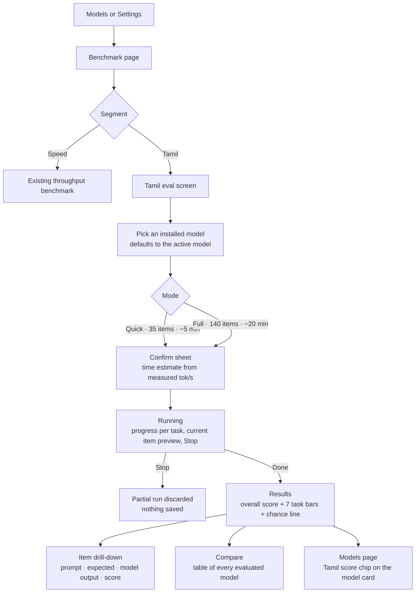

# PRD: Tamil LLM Evaluation & Benchmarking

| | |
|---|---|
| **Issue** | [#3 Add Tamil LLM Evaluation & Benchmarking](https://github.com/Abhinivesh2729/Thinai/issues/3) |
| **Status** | Draft, for maintainer review |
| **Companion doc** | [LLD.md](LLD.md) (low-level design) |
| **Target version** | 2.4.x |

---

## 1. Problem

Thinai tells users which models are good at Tamil, but that claim is a guess. `ModelTraits.tamil` in `lib/models_repo/model_skills.dart` is a hand-set boolean, and the recommender ranks models for `UseCase.tamil` with it. Nobody can see *how* good a model is at Tamil, compare two models, or check whether a Q4 quantisation lost the language.

People test this today by typing Tamil prompts and reading the replies. That is subjective, hard to repeat, and gives no number to compare.

The speed benchmark already solved the same problem for throughput: it replaced the estimate with a measurement taken on the user's phone. This feature does the same for Tamil ability.

## 2. Goals

1. **G1: A repeatable Tamil score.** Running the same model on the same dataset version gives the same score (greedy decoding, fixed prompts).
2. **G2: A score per skill and an overall score.** One score for each of the seven areas in the issue, plus one overall Tamil score.
3. **G3: Runs fully on the device.** No network, no cloud judge, no API key. This matches Thinai's offline promise.
4. **G4: Models can be compared.** Results are kept per model, so users can rank the models they installed.
5. **G5: Easy to extend.** New tasks and dataset items are data (JSON), not code. Adding an item does not need a Dart change.
6. **G6: Works with other providers (phase 3).** The same dataset and scorers can be run from a desktop CLI against any OpenAI-compatible endpoint, including Thinai's own `/v1` server, Ollama, or a hosted API.

## 3. Non-goals

- **Model-as-judge on the device.** Small on-device models can't grade reliably, and a judge would double the runtime. We can reconsider this for the phase 3 CLI.
- **A public leaderboard or uploading results.** Results never leave the phone.
- **Human evaluation, or training and fine-tuning models.**
- **Other Indic languages in v1.** The design is language-agnostic (see LLD §3), so Hindi, Malayalam and others can be added later as datasets.
- **Speech or OCR.** v1 tests text only.

## 4. Users and use cases

| User | Wants to | Example |
|---|---|---|
| Tamil-speaking end user | Pick the model that writes the best Tamil and still fits the phone | "Is Gemma 3 4B worth the extra 1.5 GB over Qwen3 1.7B for Tamil?" |
| Developer using Thinai's API | Choose a model for a Tamil app they are building on top of `127.0.0.1:11434` | Compare the translation score of two models before shipping |
| Maintainer | Replace the hand-set `tamil: true` flags with evidence | Measured scores feed the recommender for `UseCase.tamil` |
| Contributor or researcher | Add items or tasks, or run the same set on desktop models | Add 20 grammar items in one JSON file |

## 5. Scope: the seven tasks

Each area in the issue becomes one task. Every task has a fixed prompt template, an item format and a scorer. Scores are 0 to 100.

| # | Task (issue wording) | Item format | How it is scored | Why this scorer |
|---|---|---|---|---|
| T1 | Tamil comprehension | Tamil passage + multiple-choice question (options A to D) | Accuracy (the chosen letter matches) | Objective. Tests reading, not writing. |
| T2 | Tamil text generation & fluency | Open prompt with limits, e.g. "write 3 sentences about…" | Heuristic fluency score: Tamil-script fidelity, length within bounds, no repetition (LLD §6.5) | There is no reference answer, and a model judge is out of scope. Labelled *heuristic* in the UI. |
| T3 | Tamil grammar | Pick the correct sentence or suffix (A to D) | Accuracy | Grammar rules (case suffixes, sandhi, plurals, agreement) fit multiple choice well. |
| T4a | Tamil → English translation | Tamil sentence + English reference | chrF (0–100) | Standard for translation, and more robust than BLEU on short sentences. |
| T4b | English → Tamil translation | English sentence + Tamil reference | chrF (0–100) | Character n-grams handle Tamil's agglutination better than word-level scores. |
| T5 | Tamil question answering | Short factual or extractive question + accepted answers | Best of exact match and token F1, after normalising Tamil text | The standard SQuAD-style scores, with Tamil-aware normalisation. |
| T6 | Contextual understanding | Short dialogue or passage + a question that needs the context (who a pronoun refers to, an idiom in context, implied meaning), A to D | Accuracy | Tests reasoning over context, separate from plain reading. |
| T7 | Tamil-specific knowledge | Culture, literature (Thirukkural, Sangam), geography, history, festivals, A to D | Accuracy | Measures knowledge, not language skill. Kept as its own score so it doesn't hide the language scores. |

T4a and T4b are shown as two sub-scores that average into one **Translation** score, so the overall score has seven equal parts, matching the issue.

### Overall Tamil score

```
overall = mean(T1, T2, T3, T4, T5, T6, T7)   // equal weights, 0–100
```

Equal weights are the easiest to explain and hard to game. Weights are stored in the dataset manifest, so we can change them later without a code change.

### Honesty rules for the results UI

- Multiple-choice tasks show the **chance line (25%)**. A score at or below 35% is labelled *"near chance"*.
- Every task shows how many items it was scored on. Quick mode results carry an *"indicative"* badge.
- T2 is always labelled *heuristic*.
- A score belongs to one **dataset version**. Scores from different versions are never compared side by side.

## 6. Dataset

| Property | Decision |
|---|---|
| Format | Versioned JSON bundled as a Flutter asset: `assets/eval/tamil/v1/` (schema in LLD §4) |
| Size, v1 | **140 items**: 20 per task (T4 is 10 ta→en + 10 en→ta) |
| Quick mode | A fixed 5-item subset per task, **35 items** |
| Source | **Written by contributors** and released under the repo's MIT licence. We don't copy from sets like FLORES-200 (CC BY-SA 4.0, share-alike) or IndicQA until the maintainer approves the licences (see open question Q2). |
| Review | Every item is checked by at least one fluent Tamil reader other than its author. The PR template gets a checkbox for this. |
| Contamination | Hand-written, new items are unlikely to be in any model's training data. Famous texts (e.g. Thirukkural) are allowed only in T7, where recall is the point. |
| Script | Only Tamil script (U+0B80–U+0BFF) plus ASCII digits and punctuation. Validated by a unit test. |

Example items (the real set is authored in phase 1):

```json
{ "id": "t7-003", "task": "knowledge",
  "question": "திருக்குறளை இயற்றியவர் யார்?",
  "options": ["கம்பர்", "திருவள்ளுவர்", "இளங்கோ அடிகள்", "ஔவையார்"],
  "answer": "B" }

{ "id": "t5-011", "task": "qa",
  "question": "தமிழ்நாட்டின் தலைநகரம் எது?",
  "answers": ["சென்னை"] }
```

## 7. User experience

### 7.1 Where it lives

The existing **Benchmark** page (opened from Models → speedometer icon, or Settings → *Benchmark this phone*) gets a segmented control at the top:

```
[ Speed ]  [ Tamil ]
```

*Speed* is today's page, unchanged. *Tamil* is the new evaluation screen. Keeping both on one page means no new navigation, and users already expect measurements to live there.

### 7.2 User flow



### 7.3 Screens

1. **Setup.** Model picker (reuses `_ModelPicker`), Quick/Full toggle, dataset version, and a time estimate. If there is a speed benchmark result for the model, the estimate uses it; otherwise it falls back to the recommender's estimate.
2. **Running.** Progress per task (e.g. `Grammar 12/20`), overall progress, a live preview of the model's current answer (reuses `_OutputCard`), and a Stop button. The screen stays awake. A notice explains that leaving the page pauses the run (LLD §7).
3. **Results.** A large overall score, seven horizontal bars with the chance line on the multiple-choice tasks, and badges (*indicative*, *heuristic*, *near chance*). Tapping a task opens its items.
4. **Item drill-down.** A list of items with ✓/✗ or a score. Each item expands to show the prompt, expected answer, raw model output and parsed answer. This makes the score explainable and lets reviewers find bad items.
5. **Compare.** A table of every model evaluated on this dataset version, sortable by overall score or by task.

### 7.4 Edge cases

| Case | Behaviour |
|---|---|
| No models installed | Reuse `_EmptyBenchmark` |
| Model marked English-only (`LanguageReach.english`) | Allow the run, with a warning: "This model wasn't trained for Tamil; expect near-chance scores." |
| Embedding model selected | Not listed (only chat models can be evaluated) |
| GPU crash during a run | Covered by the engine's existing GPU crash guard. After relaunch the run is gone, and the user sees the existing GPU notice. |
| App backgrounded | The run pauses, and resumes when the page is visible again (LLD §7) |
| Model outputs an unparseable MCQ answer | The item is scored wrong and marked *unparsed* in the drill-down |
| API server busy with an external client | Eval requests queue behind it in `LlmEngine` like any chat request. A banner says so. |

## 8. Success metrics

| Metric | Target |
|---|---|
| Same score on a repeat run (same model, dataset version, device) | Overall score within ±1 point, 10 runs |
| Full run on a mid-range phone (≈10 tok/s decode, 2B Q4) | ≤ 25 min |
| Quick run, same phone | ≤ 6 min |
| Tamil-capable models (`tamil: true`) vs English-only models | Mean overall score clearly higher (sanity check that the benchmark works) |
| Test coverage of new code | 100% (CI gate) |
| Crashes caused by the feature | 0 |

## 9. Phases

| Phase | Deliverable | PR |
|---|---|---|
| **0** | This PRD + LLD, agreed with the maintainer | this PR |
| **1** | `lib/eval/`: dataset schema + loader, Tamil text normalisation, all scorers, runner (no UI), v1 dataset (140 items), unit tests at 100% coverage | 1 PR, or 2 if the dataset is reviewed separately |
| **2** | UI: *Tamil* segment, setup / running / results / drill-down / compare screens, results store, Tamil score chip on the Models page | 1 PR |
| **3** | `tool/tamil_eval.dart`, a desktop CLI that runs the same dataset against any OpenAI-compatible endpoint; the recommender uses measured Tamil scores for `UseCase.tamil` | 1–2 PRs |

## 10. Risks

| Risk | Impact | Mitigation |
|---|---|---|
| 20 items per task is a small sample, so scores vary | A 5-point gap may be noise | Show n. Mark Quick results *indicative*. Grow the dataset in v2. |
| Fluency (T2) can't be measured objectively | Misleading T2 score | Label it heuristic. Keep the scorer simple and documented. Phase 3 CLI could add a model judge. |
| Mistakes in authored items | Wrong scores | Two-person review. Item drill-down makes bad items visible. Validation tests. |
| Dataset licences | Can't ship data | v1 is written from scratch under MIT |
| Long runs heat the phone and drain the battery | Bad experience | Quick mode, time estimate before starting, Stop at any time |
| 100% coverage CI gate | Blocks merge | Scorers and runner are pure Dart with an injected generator, so they can be tested without native code (LLD §8) |

## 11. Open questions for the maintainer

1. **Q1.** Should Tamil be a segment on the Benchmark page (proposed), or its own page?
2. **Q2.** May we use permissively licensed public data (e.g. FLORES-200 devtest for T4, which is CC BY-SA 4.0) with attribution, or should v1 stay 100% hand-written?
3. **Q3.** In phase 3, should measured Tamil scores **replace** the `tamil: true` trait in the recommender, or only break ties between models that have it?
4. **Q4.** Are equal task weights OK for the overall score?
5. **Q5.** Does anyone on the team have time to review Tamil items (see §6)?
